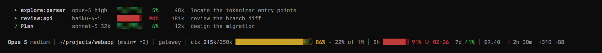

# claude-statusline

A status line for Claude Code built around one number: how close the session is to the
point where the model starts losing the thread.



## Why the gauge is not the context window

Most status lines plot usage against the model's context window, so a 1M window sits at
a comfortable 20% while the answers have already gone vague. Context rot is absolute,
not proportional. Quality degrades somewhere past 200k tokens whether the window holds
200k or a million.

So the gauge measures usage against a comfort budget instead: 250k tokens, capped at 80%
of the real window so it never promises room the window does not have. On a 200k window
it turns red at 160k, before compaction is forced on you. The window percentage follows
the gauge in grey.

## Install

Requires Python 3.7 or later and Claude Code 2.1.153 or later. No dependencies.

Clone the repository, then point `~/.claude/settings.json` at it:

```json
{
  "statusLine": {
    "type": "command",
    "command": "python -X utf8 /path/to/claude-statusline/statusline.py",
    "padding": 0,
    "refreshInterval": 10
  },
  "subagentStatusLine": {
    "type": "command",
    "command": "python -X utf8 /path/to/claude-statusline/subagent_statusline.py"
  }
}
```

On Windows, write the path with forward slashes. Restart Claude Code afterwards; neither
setting is re-read while a session is open.

## The status line

| Segment | Example | Notes |
|---|---|---|
| Model and effort | `Opus 5 medium` | |
| Directory and git | `~/projects/webapp (main* ↑2)` | `*` for uncommitted or untracked changes, `↑` `↓` for commits ahead and behind |
| Session name | `gateway` | Shown once the session is named with `--name` or `/rename`, or gets a generated title |
| Context | `ctx 215k/250k`, gauge, `86% · 22% of 1M` | `◬ saturated` once usage passes the budget |
| Rate limits | `5h`, gauge, `91% ⟳ 02:26  7d 41%` | The 5-hour reset time appears from 85% |
| Session | `$9.40  ◷ 2h 30m  +310 −88` | Cost, elapsed time, lines added and removed |

Colours come from your terminal theme. Context turns yellow at 60% of the budget and red
at 100%; rate limits turn yellow at 60% and red at 85%.

The context gauge widens with the terminal, from 12 cells up to 28 at 187 columns. The
5-hour limit gets its own gauge from 175 columns. Widths depend only on the terminal
size, so a gauge never changes length between refreshes. The line stops 4 columns short
of the terminal width, which Claude Code keeps for its own margins.

The line never wraps. When it runs out of room, segments drop in this order: session
name, lines changed, elapsed time, cost, window percentage, directory, rate limits. Model
and context gauge always stay. The session name goes first because Claude Code already
shows a name set with `--name` or `/rename` on its prompt bar.

## Subagent rows

`subagent_statusline.py` replaces the default rows in the agent panel. Each row shows a
status mark (`▸` running, `·` pending, `✓` done, `✗` failed), the label, the model and
any explicit effort, a gauge against that agent's own context window, the tokens used
and the description. Columns line up across rows while the panel is wide enough.

The gauge appears once the agent's model is known, which needs Claude Code 2.1.205.
Effort appears only when it was set explicitly, which needs 2.1.214; no effort means the
agent inherited the session's.

## Tests

```
python -X utf8 test_statusline.py
```

The suite uses only the standard library, so it runs anywhere the status line does. It
covers line width, colours, the symbols drawn, the subagent rows, and malformed input,
which may drop its own segment but never the line.

## Details

- Built for dark terminal themes.
- Some symbols, such as `◬`, `◷` and `⟳`, are missing from many monospace fonts. Each one
  is followed by a space, so a wider fallback glyph cannot overlap the next character.
- `git status` runs at most once every 5 seconds per session.
- `python statusline.py --version` prints the installed version. Bump `VERSION` in
  `statusline.py` whenever either script changes.

## License

MIT
